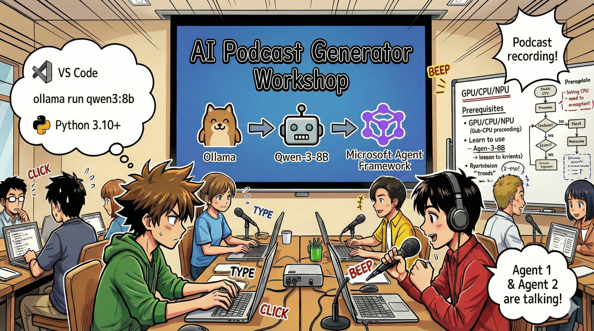
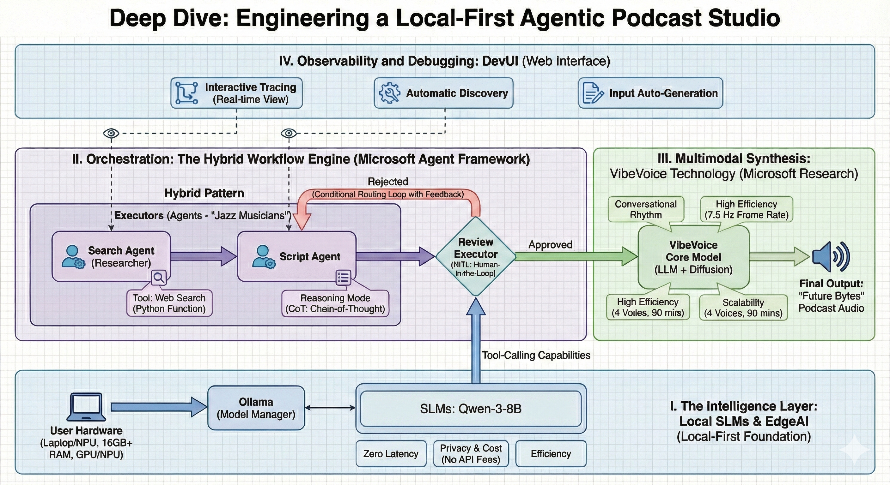

# 🎙️ The AI Podcast Studio Workshop




## Your Mission

Welcome to **The AI Podcast Studio**! You're about to launch your own tech podcast called "Future Bytes" — but here's the twist: you'll build an AI-powered production team to help you create it. No more endless hours of research, scriptwriting, and audio editing. Instead, you'll code your way to becoming a podcast producer with AI superpowers.

## The Story

Imagine this: You and your friends want to start a podcast about the coolest tech trends, but everyone's busy with school, work, or just life. What if you could build a team of AI agents to do the heavy lifting? One agent researches topics, another writes engaging scripts, and a third turns text into natural-sounding conversations. Sound like sci-fi? Let's make it real.

## What You'll Learn

By the end of this workshop, you'll know how to:
- 🤖 Deploy your own local AI model (no API costs, no cloud dependency!)
- 🔧 Build specialized AI agents that actually work together
- 🎬 Create a complete podcast production pipeline from idea to audio

## Your Journey: Three Acts



Like any good story, we've got three acts. Each one builds your AI podcast studio piece by piece:

| Episode | Your Quest | What Happens | Skills Unlocked |
|---------|-----------|--------------|----------------|
| **Act 1** | [Meet Your AI Assistants](md/01.BuildAIAgentWithSLM.md) | You discover how to create AI agents that can chat, search the web, and even solve problems. Think of them as your research interns who never sleep. | 🎯 Build your first agent<br>🛠️ Give it superpowers (tools!)<br>🧠 Teach it to think<br>🌐 Connect it to the internet |
| **Act 2** | [Assemble Your Production Team](md/02.AIAgentOrchestrationAndWorkflows.md) | Now things get interesting! You'll orchestrate multiple AI agents to work together like a real podcast team. One researches, one writes, you approve — teamwork makes the dream work. | 🎭 Coordinate multiple agents<br>🔄 Build approval workflows<br>🖥️ Test with DevUI interface<br>✋ Keep humans in control |
| **Act 3** | [Bring Your Podcast to Life](md/03.Multi-SpeakerPodcastGenerationWithVibeVoice.md) | The finale! Transform your text scripts into actual podcast audio with realistic voices and natural conversations. Your "Future Bytes" podcast is ready to ship! | 🎤 Text-to-speech magic<br>👥 Multiple speaker voices<br>⏱️ Long-form audio<br>🚀 Full automation |

Each act unlocks new abilities. Skip ahead if you're brave, but we recommend following the story!

## Environment Requirements

This workshop supports various hardware environments:
- **CPU**: Suitable for testing and small-scale usage
- **GPU**: Recommended for production environments, significantly improves inference speed
- **NPU**: Supports next-generation neural processing unit acceleration

## What You'll Need

### Software Checklist ✅
- **Python 3.10+** (Your coding language)
- **Ollama** (Runs AI models on your machine)
- **LM Studio** (If you want to see more than Ollama)
- **VS Code** (Your code editor)
- **Python Extension** (Makes VS Code smarter)
- **Git** (For grabbing code)

### Hardware Check 💻
- **Can I run this?**: 8GB RAM, 10GB free space (works, but might be slow)
- **Ideal setup**: 16GB+ RAM, a decent GPU (smooth sailing!)
- **Got an NPU?**: Even better! Next-gen performance unlocked 🚀

## Setup Your Studio 🎬

### Step 1: Python Power-Up

Make sure you've got Python 3.10 or newer:

1) Install UV
- https://docs.astral.sh/uv/getting-started/installation/


### Step 2: Get Ollama (Your AI Model Runner)

Head to [ollama.ai](https://ollama.ai) and download Ollama for your OS. Think of it as the engine that runs your AI models locally.

OR

Download [LM Studio](https://lmstudio.ai/) - A friendly (and MORE powerful) version

Check if it's ready:

```bash
ollama --version
```

### Step 3: Download Your AI Brain 🧠

Time to grab the Google's Gemma4 model (it's like hiring your first AI assistant):

```bash
ollama pull gemma4:latest
```

*This might take a few minutes. Perfect time for a coffee break! ☕*


### Step 4: Set Up VS Code

Grab [Visual Studio Code](https://code.visualstudio.com/) if you don't have it. It's the best code editor around (fight me 😄).

### Step 5: Python Extension

In VS Code:
1. Hit `Ctrl+Shift+X` (or `Cmd+Shift+X` on Mac)
2. Search "Python"
3. Install the official Microsoft Python extension

### Step 6: You're All Set! 🎉

Seriously, you're ready to rock. Let's build some AI magic!

### Step 7: Install Microsoft Agent Framework and Related Packages 📦

Install all required dependencies for the workshop:

```bash
uv venv
  -->  Activate the green line
uv sync
```

*This will install Microsoft Agent Framework and all necessary packages. Grab a coffee — first-time setup might take a few minutes! ☕*

## Workshop Instructions

Detailed project structure, configuration steps, and execution methods will be explained step-by-step during the workshop.

## Troubleshooting (When Things Go Wrong) 🔧

### "Ugh, the model download is taking forever!"
**Fix**: Use a VPN or configure Ollama with a mirror source. Sometimes the internet just hates us.

### "My computer is dying! Out of memory!"
**Fix**: Switch to a smaller model or tweak the `num_ctx` setting to use less memory. Think of it as putting your AI on a diet.

### "Can I make this faster with my GPU?"
**Fix**: Ollama auto-detects GPUs! Just make sure your GPU drivers are up to date. Free speed boost! 🏎️

## Extra Resources (For the Curious) 📚

- [Ollama Docs](https://github.com/ollama/ollama) — Deep dive into local AI models
- [Microsoft Agent Framework](https://microsoft.github.io/autogen/) — Learn more about building agent teams
- [Qwen Model Info](https://qwenlm.github.io/) — Meet your AI assistant's brain

## License

MIT License — Build cool stuff, share it, make the world better! 🌍

## Want to Contribute?

Found a bug? Got an idea? Drop an Issue or PR! We love community vibes. ✨

