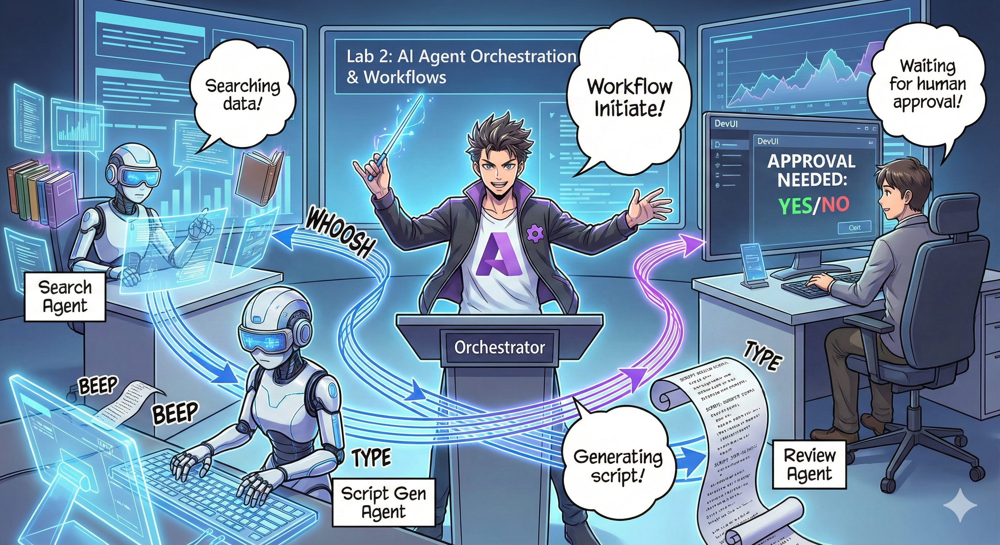

# Act 2: Assemble Your Podcast Production Team 🎬



## The Plot Thickens

Alex (your AI assistant from Act 1) is awesome, but one agent can't run a whole podcast studio. You need a *team*:
- 🔍 **Research Agent**: Scours the internet for fresh info
- ✍️ **Script Agent**: Turns research into engaging dialogue
- 👤 **You (The Editor)**: Approves scripts or sends them back for rewrites

Welcome to **AI Agent Orchestration** — where you become the director of your own AI crew. Think Avengers, but for podcast production.

## What's Agent Orchestration? (The Simple Version)

Imagine you're running a restaurant. You don't do everything yourself, right? You've got:
- 🍳 A chef who cooks
- 👨‍🍳 A sous chef who preps
- 👩‍🍳 A server who delivers

Agent orchestration is the same idea, but with AI. Each agent has a specialty, and you coordinate them to achieve bigger goals. No single agent is overwhelmed, and the work gets done faster.

### The Band Analogy 🎸

Your AI agents are like a band:
- **Lead singer**: The main agent handling customer-facing tasks
- **Drummer**: Keeps the rhythm, handles background processing  
- **Bass player**: Supports everyone, fetches data
- **You (Band Manager)**: Coordinate it all!

Without coordination? Just noise. With orchestration? Beautiful music.

### Why This Matters

One AI agent trying to do everything = burnout. Specialized agents working together = efficiency unlocked! 🚀

**Real Talk**: Remember trying to research, write, AND edit your podcast alone? Yeah, that sucks. With orchestration, each agent handles what it's best at. You just make the final calls.

**Real-World Example**: Customer support bots that know when to handle billing vs. tech issues vs. when to call a human. That's orchestration!

## Agent vs. Workflow: What's the Difference?

Think of it this way:

### 🤖 AI Agent = Jazz Musician
- **Makes decisions on the fly** based on what it hears
- **Improvises** solutions using its tools
- **Thinks** with an LLM brain
- **Adapts** to whatever you throw at it

### 🎵 Workflow = Orchestra Playing Classical Music  
- **Follows a score** (predefined steps)
- **Predictable** execution path
- **Coordinates** multiple agents, humans, systems
- **Structured** like a recipe

**The Magic**: Workflows *orchestrate* agents! You build a workflow that tells agents when to play their part. Best of both worlds. 🎭

## Three Ways to Coordinate Your AI Crew

### 1. 🎯 Centralized (You're the Boss)

One main agent calls all the shots. Think of it like you managing a team — you decide who does what and when.

**Pros**:
- ✅ Clear leadership (no confusion)
- ✅ Consistent decisions
- ✅ Easy to debug

**Use it for**:
- Customer service routing ("Is this billing or tech support?")
- Content approval workflows ("Does this script pass?")
- Podcast production (exactly what we're building!)

### 2. 🤝 Decentralized (Agents Self-Organize)

Agents talk directly to each other and figure things out as a group. Like a group chat where everyone coordinates.

**Pros**:
- ✅ Scales easily (add more agents anytime)
- ✅ No single point of failure
- ✅ Agents collaborate naturally

**Use it for**:
- Research teams (each agent explores different sources)
- Brainstorming sessions
- Distributed problem-solving

### 3. 🔀 Hybrid (Best of Both Worlds)

You set the overall direction, but agents have freedom to self-organize on tasks. Like being a CEO who trusts their team.

**Perfect for**: Complex projects that need both control and flexibility.

## Microsoft Agent Framework: Your Orchestration Toolkit 🧰

Time to build! Here's what you'll use:

### The Building Blocks

#### 1. 🧱 Executors (Your Workers)
- **What they are**: Individual processing units — could be agents or custom logic
- **What they do**: Take input, do work, produce output
- **Think of them as**: Stations in an assembly line

#### 2. ➡️ Edges (The Connections)
- **What they are**: Paths between executors
- **What they do**: Control message flow ("After A, go to B")
- **Think of them as**: Arrows on a flowchart

#### 3. 🗺️ Workflows (The Master Plan)
- **What they are**: The complete graph of executors + edges
- **What they do**: Define the entire process from start to finish
- **Think of them as**: Your production pipeline blueprint

### Cool Features You'll Love

**🛡️ Type Safety**: Messages between agents are type-checked. No "Oops, wrong data type" surprises.

**🔀 Flexible Routing**: 
- If-then conditions ("If approved, publish; else, rewrite")
- Parallel processing (multiple agents work simultaneously)
- Dynamic paths (workflow adapts based on results)

**🔌 External Integration**:
- Connect to APIs
- Add human-in-the-loop checkpoints (you approve before publishing)
- Build request/response flows

**💾 Checkpointing**: Save progress! If something crashes, pick up where you left off.

**🤝 Multi-Agent Coordination**:
- Run agents in sequence (A → B → C)
- Run them in parallel (A + B + C at once)
- Hand off between agents
- Collaborative processing

## Best Practices (Pro Tips) 🎯

### 1. Keep It Modular
Each agent should do ONE thing really well. Don't make a "super agent" that does everything — you'll regret it when debugging.

### 2. Plan for Failures
Agents mess up. Networks fail. Build in error handling and backup plans. Your future self will thank you.

### 3. Monitor Everything
Track what your agents are doing. Use DevUI (we'll cover this!) to see workflows in action.

### 4. Optimize Message Size
Don't pass giant files between agents. Keep messages lean and mean for speed.

### 5. Choose the Right Pattern
Need control? Go centralized. Need scale? Go decentralized. Can't decide? Go hybrid!

## DevUI: Your Workflow Debugger 🔍

### What's DevUI?

DevUI is like a playground for testing your agents and workflows. It's a web interface where you can:
- 👀 Watch your workflow in action
- 💬 Chat with agents directly
- 🔍 Debug when things go wrong
- 📊 See traces and performance metrics

> **Important**: DevUI is for development only! Don't use it in production. Think of it as your local testing environment.

### What Makes It Awesome

- **🖥️ Interactive Web UI**: Click, type, test — no command line needed
- **📁 Drag-and-Drop Ready**: Upload files, test with different inputs
- **📂 Auto-Discovery**: Point it at a folder, it finds all your agents automatically
- **📋 No-Setup Mode**: Register agents in code, no folder structure needed
- **🔌 OpenAI Compatible**: Works with OpenAI SDK (compatibility FTW!)
- **👁️ Tracing Built-in**: See exactly what your agents are doing

### How Input Works

DevUI is smart about inputs:

- **Testing Agents?** You get text boxes and file upload buttons
- **Testing Workflows?** The UI auto-generates input fields based on what your workflow expects

It's like magic, but it's just good code. ✨

## Your Missions: Build a Podcast Studio 🎬

### Mission 1: Create a Single Agent with DevUI

📂 [01.AgentDevUI](../src/02.Workflow/01.AgentDevUI/)

**The Challenge**: Before building a full team, let's test DevUI with one agent: a web search specialist.

**What You're Building**:
A research agent that can search the internet for podcast topics. You'll test it using DevUI's web interface at `http://localhost:8090`.

**Skills You'll Learn**:
- 🚀 Launching agents in DevUI
- 🔍 Testing agent responses in real-time
- 🛠️ Building custom tools (web search)
- 📊 Enabling tracing to debug issues
- 🖥️ Using the interactive web UI

**The Code**:
- `agent.py`: Your SearchAgent with web search superpowers
- Uses OllamaChatClient to connect to Qwen
- Implements `web_search()` tool function
- Launches with `serve()` — opens DevUI automatically

**Victory Condition**: Ask your agent "What's trending in AI?" and watch it search the web! 🎉

### Mission 2: Build a Multi-Agent Workflow

📂 [02.WorkflowDevUI](../src/02.Workflow/02.WorkflowDevUI/)

**The Challenge**: Now the real fun begins! Build a complete podcast production workflow with:
1. 🔍 **Search Agent** → Researches your topic
2. ✍️ **Script Agent** → Writes a dialogue between two hosts (in Chinese!)
3. 👤 **Review Executor** → Asks YOU to approve or reject
4. 🔄 **Loop Back** → If rejected, rewrites based on your feedback

**Skills You'll Learn**:
- 🧱 Creating specialized agents for different jobs
- 🔗 Connecting agents with WorkflowBuilder
- 🔀 Implementing approval loops (human-in-the-loop!)
- 🚦 Conditional routing (if approved vs. rejected)
- 🔧 Building custom executors for business logic

**The Workflow**:
```
SearchAgent → ScriptAgent → ReviewExecutor
                             ↑          ↓ (if rejected)
                             ←─────────
```

**The Code**:
- `search_agent/agent.py`: Your research specialist
- `generate_script_agent/agent.py`: Your scriptwriter (writes in Chinese!)
- `workflow/workflow.py`: The orchestration magic happens here
- `main.py`: Launches everything in DevUI

**Victory Condition**: Give a topic, review the script, reject it once to test the loop, then approve! 🎉

### Mission 3: Build a Console App

📂 [03.Application](../src/02.Workflow/03.Application/)

**The Challenge**: Take your workflow from DevUI and turn it into a slick terminal app with colored output, loading spinners, and file saving. This is production-ready stuff!

**Skills You'll Learn**:
- ⚡ Running workflows programmatically (no DevUI)
- 📡 Event-driven architecture with streaming
- 🎨 Creating beautiful terminal UIs (colors, spinners, progress bars)
- 💾 Saving final scripts to files
- 🔄 Handling async workflows with Python's asyncio

**What It Does**:
1. Asks you for a podcast topic
2. Shows real-time progress ("Search Agent is working...")
3. Displays generated script with colors
4. Asks for your approval
5. Saves approved script to `podcast.txt`

**The Code**:
- `podcast_app.py`: Your main app with event handling
- `workflow.py`: Reuses the workflow from Mission 2
- Handles events: `AgentRunUpdateEvent`, `RequestInfoEvent`, `WorkflowOutputEvent`
- Uses ANSI colors for terminal styling

**Victory Condition**: Run the app, create a podcast script, and see it saved! You've built a real tool. 🚀

## What You've Mastered 🏆

## What You've Mastered 🏆

After Act 2, you can:

- ✅ Orchestrate multiple AI agents like a boss
- ✅ Build workflows with sequential AND conditional logic
- ✅ Add human approval checkpoints
- ✅ Use DevUI to test and debug workflows
- ✅ Create production-ready console applications
- ✅ Handle errors gracefully in complex systems
- ✅ Choose the right orchestration pattern for any project

## When Things Break 🔧

### "My workflow is too complicated!"
**The Fix**: Break it into smaller sub-workflows. Each workflow should do ONE thing well. Chain them together if needed.

### "I can't track what's happening!"
**The Fix**: Use workflow checkpointing to save state. Enable tracing in DevUI to see every step.

### "One agent's error crashes everything!"
**The Fix**: Add error boundaries. Each agent should handle its own failures and have fallback behavior.

### "This is soooo slow"
**The Fix**: Can any agents run in parallel? Sequential workflows are easy but slow. Look for parallelization opportunities!

## Helpful Resources 🔗

- [Workflow Docs](https://learn.microsoft.com/en-us/agent-framework/user-guide/workflows/overview) — Official Microsoft guides
- [Orchestration Patterns](https://www.ibm.com/think/topics/ai-agent-orchestration) — IBM's take on it
- [Agent Framework GitHub](https://github.com/microsoft/agent-framework) — Browse the source code
- [Code Examples](https://github.com/microsoft/agent-framework/tree/main/python/samples) — Steal patterns from here

---

**Ready for the finale?** You've got your script. Now let's turn it into actual audio! → [Act 3: Bring Your Podcast to Life](03.Multi-SpeakerPodcastGenerationWithVibeVoice.md) 🎤

---

**Stuck? Confused? Excited?** Share in the workshop chat! We're all learning together. 🚀